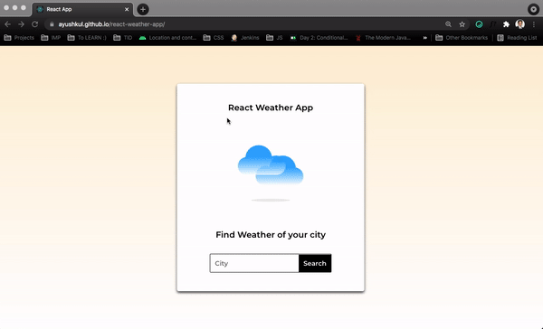

# React Weather App - ReactJS Projects

### Demo - Deployed over Github Pages 
https://ayushkul.github.io/react-weather-app

### Full development Tutorial 
[Youtube Tutorial - The Indian Dev](https://www.youtube.com/watch?v=_UXycMmVYj0)

### APIs Used
[Open Weather APIs](https://openweathermap.org/)

https://openweathermap.org/current

### API Info
* Method: `GET`
* URL: `https://api.openweathermap.org/data/2.5/weather?q={CITY_NAME}&appid={API_KEY}`

### Icons & Font -
* Icons: [ayushkul/react-weather-app](https://github.com/ayushkul/react-weather-app/tree/master/public/icons)
* Font Link: `<link href="https://fonts.googleapis.com/css2?family=Montserrat:wght@400;500;600&display=swap" rel="stylesheet">`

### Libraries used
* `styled-components`
* `axios`
* `react-scripts`

### Whom do I talk to? ###

* AyushK : [The Indian Dev](https://www.instagram.com/theindiandev)

### How can I appreciate this repo? ###

* By giving this repo a 🌟
* By Subscribing : [The Indian Dev](https://www.youtube.com/channel/UCbaR6YYn5VGXrR5_f-4tNsA) at Youtube
* By Following : [The Indian Dev](https://www.instagram.com/theindiandev) at Instagram

